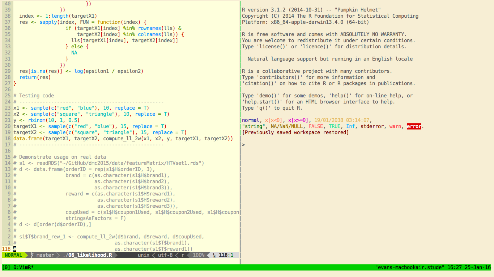

# Week 1: February 5

## Getting started with Vim  

Vim is an all-purpose, lightweight text editor that can be accessed through the 
command line. Actually it is the default command-line editor on Mac OS X. While 
it can be intimating to learn, the benefits of mastering Vim far outweight the steep 
learning curve in our opinion.

Basically the point of Vim is so that you can type and edit code much faster. It 
is used on the command line because there is no point of having a graphical user 
interface with Vim - everything you do is with the keyboard, and in fact you 
should never have to remove your hands from the keyboard while using Vim.
There are many key combinations to learn that make this possible. You will 
learn how to navigate, search for text, copy and paste, 
perform regular expression searching and replacing, and many more things 
all with the touch of a few keys.

People have written a huge variety of plugins (extensions) for Vim that make it 
way more than just an efficient typing machine. For example:

- vim-latex is a great plugin for LaTeX that allows you to quickly create new enviroments 
and jump outside of an environment when you are finished type in it.
- vim-R-plugin is extension that allows to send code as you write it to an 
R session in another arbitrary terminal window. It also has support for doing 
the same with Python. This is what an interactive session looks like with 
vim-R:

- emmet-vim is extension that allows to write HTML code with amazing efficient.
You can create arbitrary nested elements using a special syntax and key 
combination, and then jump around between text input spaces. 
- nerdcommenter gives you shortcuts to beautifully comment lines or blocks of 
code in just about any language.
- Ian wrote an awesome plugin himself, called iliketowatch, which automatically
refreshes pages in a browser as you edit them in Vim.

The other appeal of Vim is that it is highly customizable. If you look at my 
Vim setup (Evan) versus Ian's, they look like a completely different text 
editor. Not only is the visual appearance of our editors completely different,
but both of us have customized our shortcuts and key combinations to suit our 
own needs. As you will find out, you become very invested in your personal 
Vim setup. The relationship you will have with your Vim editor will be like any 
relationship - it takes work, and sometimes you may get frustrated, but if you stick
with it you will love your partner (Vim) and may even experience separation
anxiety when you are forced to be apart for too long.

### Installing

See main page for links to installation instructions. On Mac, you alread have 
Vim installed, but we recommend installing an updated version via Homebrew. If Homebrew 
is installed, this should be as simple as typing ```brew install vim``` from the 
command line.

### Your first task 

If you have never used Vim before, the first thing you should do is work through 
the interactive tutorial. This will take about 30 minutes and give you the basics 
to start editing files. Here is how you get started:

- Get into the command line
- Type ```vim```
- Type ```:help tutor```, and you'll be on your way!


