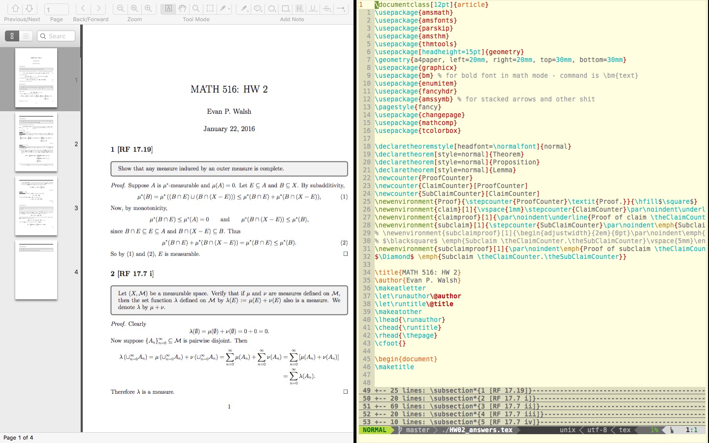

## Installation

Make sure you have latex installed FIRST

The hard way:
- Download the latest version of vim-latex at [http://sourceforge.net/projects/vim-latex/files/snapshots/](http://sourceforge.net/projects/vim-latex/files/snapshots/)
- Extract the archives into your ```~/.vim``` folder.

The easy way - installing via Bundle
- Add this to your .vimrc in the Vundle section: ```Bundle 'git://git.code.sf.net/p/vim-latex/vim-latex'```
- You may not understand this yet, but don't worry, we'll get to it in later meetings.
