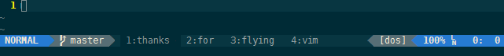
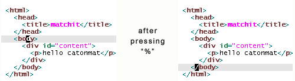

First of all, I would like to thank Pete for a wonderful job introducing tools that convert Vim from a text editor into a full coding environment.
Great work Pete!

Now for this week:

## Plug-In-Palooza and Working Group Project


### Plug-In-Palooza I

This is a concept I've been baking in the back of my mind for a while now: Plug-In-Palooza.

15-20 plugins, one hour to cover them. I
Because we are filling the meeting with so many plugins, each plugin has to be described in 3-4 minutes tops (talkabout 2 slides).
This means the plugins must be ["high concept"](https://en.wikipedia.org/wiki/High-concept) - the idea behind them is so clear and the way to use it is so simple that 3 minutes is all you need to know if it's something you would use or not.

Think: no hassle to install, simple to use, with a clear purpose. That's what we're going for.

If you have any plugins that fit this description that you would like to showcase, we would be more than happy to help you work a few slides into
the presentation. I think we could cover 20 plugins without breaking a sweat. This will be fast paced and fun.

### NERDTree

by Martin Grenfell [(scrooloose on GitHub)](https://github.com/scrooloose)

Install it using Vundle by adding the following line to your `.vimrc`:

```vim
   Plugin 'scrooloose/nerdtree'
```

-  Martin Grenfell has created several important and popular Vim plugins.
-  performing folder/file actions simple, visual, and 
-  Travel around your file system, opening files and folders.
-  Perform simple file system operations.
-  Start with `:NERDTree`
   -  scroll with `j`, `k`
   -  `m` to modify the current folder: `a` to add an item, `m` to move an item, `d` to delete an item, and `c` to copy
-  Add the following line to your `.vimrc` to toggle between open/close NERDTree quickly by holding the control key and hitting `n`:

```vim
   " Toggle between NERDTree open and NERDTree closed
   map <C-n> :NERDTreeToggle<CR>
```

### vim-autocorrect

By Anthony Panozzo [(panozzaj on GitHub)](https://github.com/panozzaj)

Install it using Vundle by adding the following line to your `.vimrc`:

```vim
   Plugin 'panozzaj/vim-autocorrect'
```

-  Autocorrect commonly misspelled words 
-  Anthony Panozzo puts a lot of thought into which corrections to include (his philosophy is described on the plugins GitHub page).
-  defines 1000s (12,438 last I checked) of insert mode abbreviations: `iabrev Teh The` etc.
-  Can be uncorrected outside of insert mode (for instance in normal mode using `x` and `p` to change the word to the desired "incorrect" version)
-  [A blog post about using abbreviations to correct spelling](http://www.thegeekstuff.com/2009/03/vim-editor-how-to-correct-spelling-mistakes-automatically/)


** Tricks for Loading **
-  Loading 1000s of abbreviations takes a second and Vim will hang.

-  Because of that the default is not to have the plugin load at start - you have to load it yourself using:

```vim
   :call AutoCorrect()
```

Here are some other things you can do:

1. Load it by default: but `call AutoCorrect()` in your `.vimrc` and just deal with the hang every time you start Vim.

2. Load it for certain filetypes: for example, to load it only if you open a markdown file, add `autocmd filetype markdown call AutoCorrect()` to your .vimrc.

3. Load it the first time you click away from Vim: `autocmd FocusLost :call AutoCorrect()` in your `.vimrc`


### Colour-Sampler-Pack

Maintained by [vim.org](http://www.vim.org)

```vim
   Plugin 'Colour-Sampler-Pack'
```

- Syntax highlighting is one of the big initial draws for writing in a text editor 
- Vim allows you to create your own
- Some people have created great ones (using science)
- This package took ~100 of the most popular such schemes

http://vimcolorschemetest.googlecode.com/svn/html/index-html.html


### Surround

By Tim Pope (a Vim brand name)

From the description:

>  Surround.vim is all about "surroundings": parentheses, brackets, quotes, XML tags, and more. The plugin provides mappings to easily delete, change and add such surroundings in pairs.

-  A clever tool to change the surrounds of a string of text in a few keystrokes.

-  In normal mode, the sequence `cs<symbol><other symbol>` will change the surrounding `<symbol>` to `<other symbol>`.

-  Ex: Inside `"Hello, World!"` typing `cs"'` results in `'Hello, World!'`

-  Understands tags: `"Hello, World!"` typing `cs"<q>` results in `<q>Hello, World!</q>` 


### Vim-airline

By [Bailey Ling](https://github.com/bling), [Christian Brandy](https://github.com/chrisbra), and [Mike Harrington](https://github.com/mharington)



-  Customize the status bar to a rediculous degree.

-  Theme customizable: [wiki](https://github.com/vim-airline/vim-airline/wiki/Screenshots)

-  Written in vimscript, supports integration for many popular plugins


### Commentary

By Tim Pope (a Vim brand name)

Install using Vundle:

```vimscript
   Plugin 'tpope/vim-commentary'
```

From the GitHub page:

>  Comment stuff out. 

Creates a command `gc` for comment 

-  `gcc` coments a line (`c` for current)

-  `gcap` comments "all paragraph"

-  `gc$` comments from the current point to the end of the line

### Vitality

By [Steve Losh](http://github.com/sjl)

Install using Vundle:

```vimscript
   Plugin 'sjl/vitality.vim'
```

Because of the way `tmux` passes text around, some things are broken - specifically `FocusLost` and `FocusGained` (because you are never really focused on Vim in the first place if you are using `tmux`.

The [documentation](https://github.com/sjl/vitality.vim/blob/master/doc/vitality.txt) 
is a very good read
despite the fact that the author says (at the start of the section How It Works)

```
You don't need to know this.

You don't WANT to know this.

Turn back now or skip to the |VitalityLicense|.

You've been warned.
```

he provides a very clear, simple explanation of how tmux works and what it means for Vim.

### Matchit

By [Benji Fisher](http://github.com/benjifisher)

Install using Vundle:

```vimscript
   Plugin 'benjifisher/matchit.zip'
```
-  In normal mode, `%` finds the matching surrounding (so you can go from `{` to `}` quickly).

-  MatchIt extends this ability to several languages: LaTeX, HTML, etc.



### speeddating

By Tim Pope (a Vim brand name)

Install using Vundle:

```vimscript
   Plugin 'tpope/vim-speeddating'
```

-  In vim `<C-A>` increments a value (adds one) and `<C-X>` decrements (subract one).

-  So if we are on the 31 in `1999-12-31` and we *increment* we get `1999-12-30`

-  Vim things we want to add 1 to -31!

-  `speeddating` gives this ability to dates too - with speed dating, incrementing `1999-12-31` becomes `2000-01-01` as you would hope.

### exchange

Quickly sway words, lines, regions using `cxi` on the first region and hitting `.` on the second.

A video demonstrating this on [Vimcasts.org](http://vimcasts.org/episodes/swapping-two-regions-of-text-with-exchange-vim/)

### ack 

```vimscript
   Plugin 'mileszs/ack.vim'
```
A tool to use [ack](http://beyondgrep.com), a powerful and simple alternative to grep, from command mode.
Searches `{directories}` for patterns, shows matching files in a quickfix window

```vimscript
Ack [options] {pattern} [{directories}]
```
### ag

```vimscript
   Plugin 'rking/ag.vim'
```

A similar tool for [ag](https://github.com/ggreer/the_silver_searcher), "The Silver Searcher," also shows results in a seperate window

### Repeat


### Fugitive

### GitGutter


### Group Project

After talking with Zeb and Jennifer last week, I think we are crystallizing a concept for our working group project.
It involves Vim, R, Python, the command line - potentially Matlab, potentially SAS, potentially - and I think the idea is pretty exciting.
It might be a big project, so there will be plenty of places to jump in and share your expertise, make important contributions, or just test out the progress.


